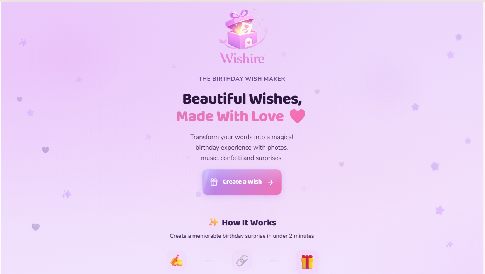
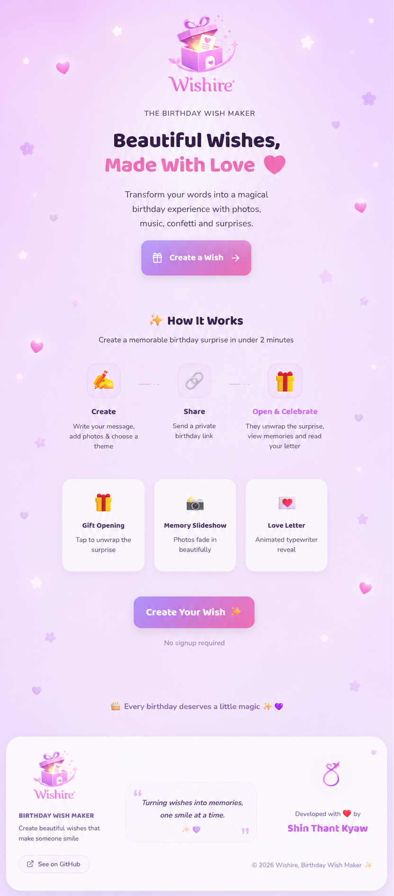
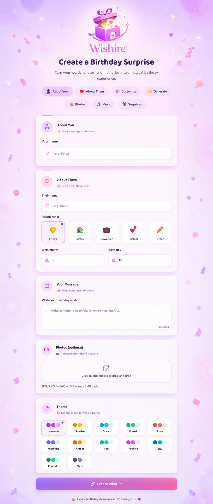
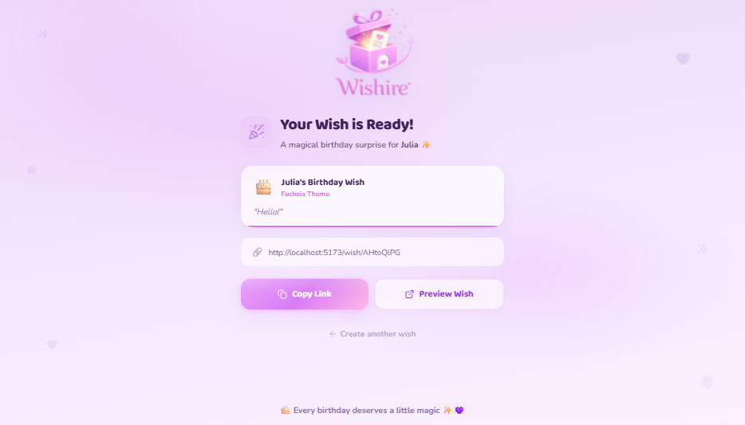

# Wishire 🎂

> Beautiful birthday wishes, sent with love.





---

## Live Demo

Coming soon — deployed demo will be linked here.

---

## About

Create unforgettable birthday surprise pages with heartfelt messages, cherished photos, beautiful animations, and music. Share a single link, and they'll unwrap a magical gift box filled with your love.

---

## Features

- 🎁 **Gift box reveal** — recipient taps to open a 3D animated gift box
- 🎉 **Confetti celebration** — full-screen confetti burst across multiple waves
- 📸 **Photo slideshow** — smooth auto-advancing carousel with dot indicators
- 💌 **Typewriter letter** — expandable card reveals a personal message letter by letter
- 🎨 **12 theme colors** — lavender, sunrise, ocean, forest, rose, midnight & more
- 🎵 **Background music** — happy birthday melody with pause/resume controls
- 🔄 **Replay** — recipient can re-experience the full surprise
- 📱 **Responsive** — looks beautiful on mobile, tablet, and desktop

---

## Tech Stack

| Layer | Technology |
|-------|-----------|
| Frontend | React + Vite, Tailwind CSS v4 |
| Animations | Framer Motion |
| Audio | Howler.js |
| Confetti | canvas-confetti |
| Backend | Node.js + Express |
| Database | Prisma + SQLite |
| File Upload | Sharp (thumbnails) + file-type (validation) |

---

## Screenshots

<div align="center">

**Landing Page**


**Landing Page (Full)**


**Create Wish Form**


**Shareable Link (Success)**


**Gift Box Reveal**


**Celebration Page**


</div>

---

## Architecture

```
┌──────────────┐     ┌──────────────┐     ┌──────────┐
│   React App   │────▶│  Express API  │────▶│  SQLite   │
│  (Vite :5173) │◀────│  (:3001)      │◀────│ (Prisma) │
└──────────────┘     └──────────────┘     └──────────┘
                             │
                     ┌───────┴───────┐
                     │  File Upload  │
                     │  + Thumbnails │
                     └───────────────┘
```

---

## Installation

```bash
git clone https://github.com/shinnThantKyaw/Wishire.git
cd Wishire
npm install && cd server && npm install && cd ../client && npm install
cd ..
npm run dev
```

App opens at `http://localhost:5173`

---

## Environment Variables

| Variable | Required | Default | Description |
|----------|----------|---------|-------------|
| `PORT` | No | `3001` | API server port |

No `.env` file needed for local development — SQLite and file uploads work out of the box.

---

## Folder Structure

```
birthday-wish-generator/
├── client/
│   ├── src/
│   │   ├── pages/           # Home, Create, Success, Wish
│   │   ├── components/
│   │   │   ├── experience/  # GiftBox, LetterCard, PhotoSlideshow, etc.
│   │   │   ├── create/      # PhotoUploader, ThemeSelector
│   │   │   └── home/        # HeroBackground, CTAButton
│   │   ├── hooks/           # useReducedMotion, useMouseParallax
│   │   └── index.css        # All styles (Tailwind + custom)
│   └── public/
│       └── assets/          # Images, audio, favicons
├── server/
│   ├── routes/              # wishes, photos
│   ├── services/            # Business logic
│   ├── middleware/           # Upload, error handling
│   ├── lib/                 # Prisma client, flair data
│   └── index.js             # Express entry point
└── .mcp.json                # MCP servers config
```

---

## Future Improvements

- Social sharing (WhatsApp, iMessage)
- Custom theme builder
- E2E tests with Playwright
- Email delivery with scheduled sends
- Visitor statistics dashboard

---

## License

MIT — feel free to fork and make it your own.

---

## Author

[shinnThantKyaw](https://github.com/shinnThantKyaw)
